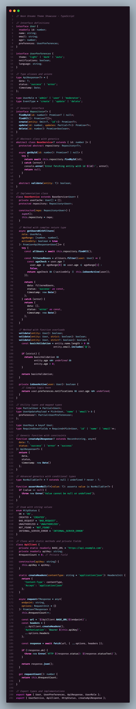
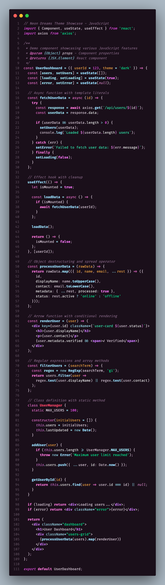
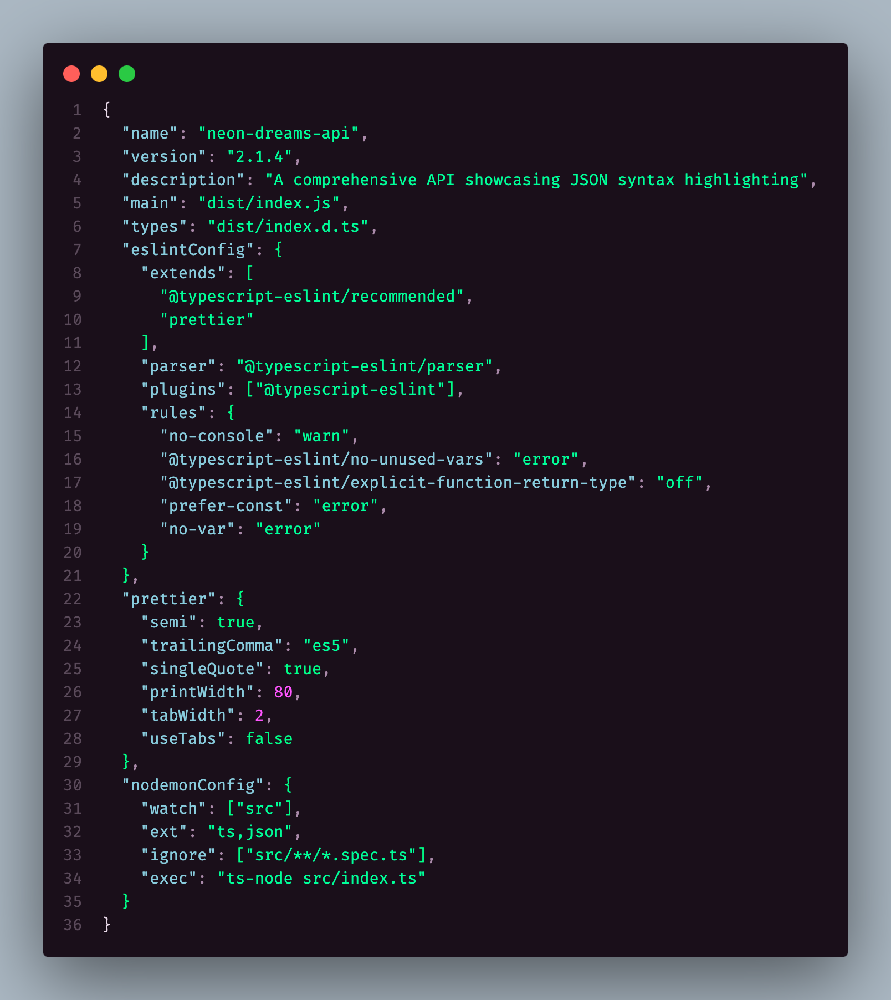
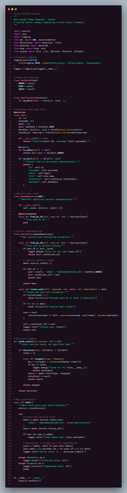

# Neon Dreams Theme

Beautiful developer themes with balanced neon colors and pastel variants - optimized for Cursor IDE and all programming languages.

## 🎨 Theme Variants

### Neon Dreams (Dark)
A sophisticated dark theme with a soft pink/purple background and carefully balanced color palette featuring pink/purple core colors with complementary blues, teals, and warm tones for optimal readability.

### Neon Dreams Pastel (Dark)
A softer dark theme with enhanced pastel colors that maintain excellent contrast while providing a more gentle coding experience with the same balanced color approach.

## ✨ Features

- **🎯 Optimized for Cursor IDE**: Special chat component colors and enhanced inlay hints
- **🌈 Balanced color palette**: Pink/purple core with complementary blues, teals, and warm tones
- **💡 Enhanced inlay hints**: Subtle type and parameter hints optimized for Cursor's AI features
- **🔧 All major languages**: JavaScript, TypeScript, Python, CSS, JSON, Markdown, HTML, JSX/TSX, and more
- **🌈 Bracket pair colorization**: 6 distinct colors for nested brackets
- **🔍 Semantic highlighting**: Advanced syntax highlighting for modern development
- **⚡ Error & warning integration**: Clear visual indicators for linting and diagnostics
- **🎨 Git integration**: Intuitive colors for file status and changes
- **📱 Responsive design**: Works beautifully across all VS Code/Cursor interfaces

## 🚀 Language Support

### JavaScript & TypeScript
- Function declarations, calls, and methods with distinct blue variations
- Async/await keywords with special pink styling
- Template strings and interpolation in teal
- JSX/TSX components in bright purple
- `this` and `super` keywords with italic styling
- Object properties in clean white for clarity

### Python
- `self` parameter highlighting in purple
- Decorators with warm orange styling
- Magic methods with special pink colors
- Type hints and annotations in blue

### CSS
- Property names in blue, values in teal
- Selectors in pink for clear distinction
- CSS-in-JS support

### JSON
- Keys in blue, values in teal for easy parsing

### Markdown
- Headers in pink, bold in blue, italic in teal
- Code blocks in purple, links in green
- Quote blocks with subtle purple styling

## 🎨 Color Palette

### Neon Dreams (Main Theme)
A sophisticated dark theme featuring vibrant pink and purple keywords, complemented by soothing teal strings and crisp blue functions for optimal readability and visual appeal.

### Neon Dreams Pastel
A gentler variant with softer pastel tones that maintain the same beautiful color harmony while providing a more subtle coding experience.

## 📦 Installation

1. Open VS Code or Cursor
2. Go to Extensions (Ctrl+Shift+X)
3. Search for "Neon Dreams Theme"
4. Click Install
5. Go to File > Preferences > Color Theme
6. Select "Neon Dreams" or "Neon Dreams Pastel"

## 📸 Screenshots

### TypeScript

### JavaScript

### JSON

### Python

## 📝 License

MIT License - see [LICENSE](LICENSE) file for details.

## 🤝 Contributing

Contributions are welcome! Please feel free to submit issues and pull requests on our [GitHub repository](https://github.com/neon-dreams/neon-dreams-theme).

---

**Enjoy coding with Neon Dreams! 🌟** 